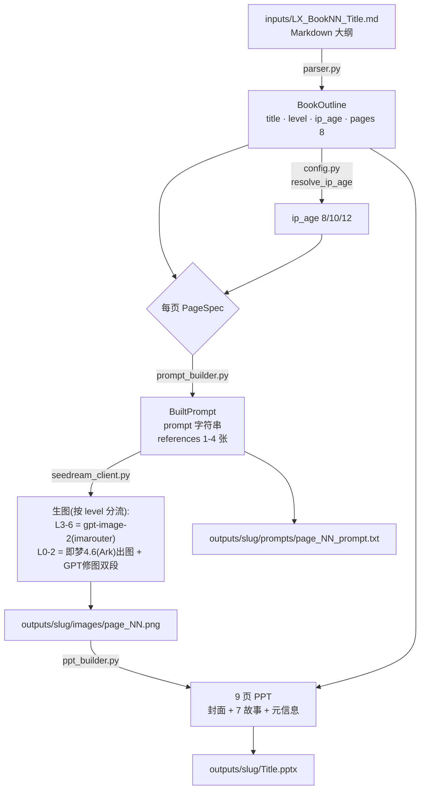
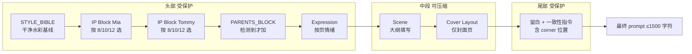
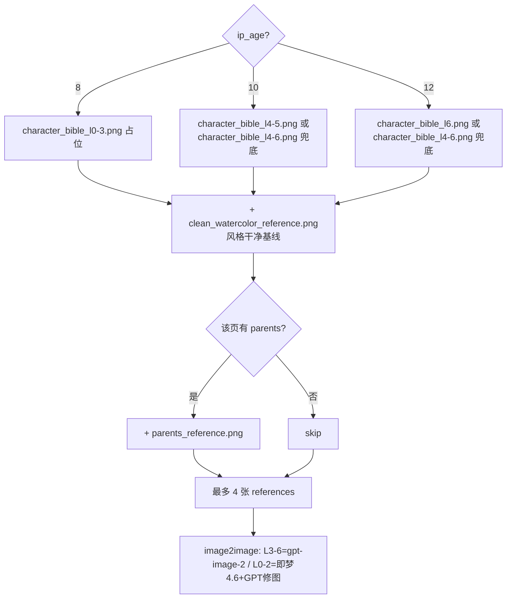
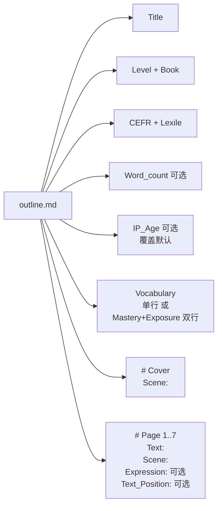
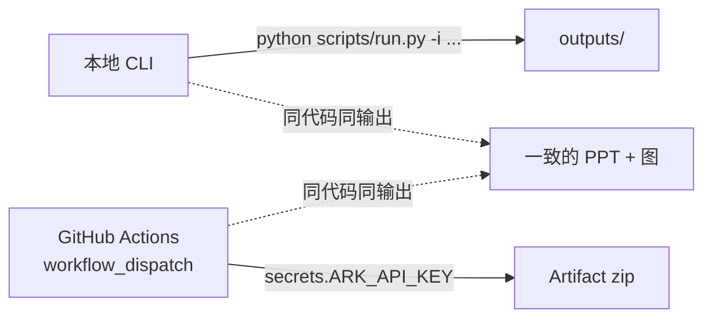

# 绘本自动化流水线

> 输入：一份 9 页 Markdown 大纲
> 输出：1 个 9 页 PPT + 8 张水彩插画 + 8 个 prompt 存档

## 一、整体数据流



## 二、Prompt 拼装结构



* 头部 + 尾部固定不能被截
* 仅中段 (`Scene + Cover Layout`) 超长时被 `...` 截尾

## 三、参考图收集策略



## 四、9 页 PPT 几何

```
+------------------------------------------------+ 10.0 in
|  Title 居中靠上            Lv X / Book N 橙胶囊 |     ↑
|                                                |
|                  全幅插画 (full-bleed)           |
|                                                |     7.5 in
|         [文字框 40% 宽 落留白角]                  |
|                                                |
|  页码圆 (偶数页 左下 / 奇数页 右下)                 |     ↓
+------------------------------------------------+

P1 封面     | 标题 + Level/Book 双胶囊 + 全幅图
P2-P8 故事  | 全幅图 + 文字框落 Text_Position 指定角 + 页码
P9 元信息   | Level / Book / CEFR / Lexile / Word count / Vocabulary
```

## 五、模块职责

| 文件 | 职责 | 关键产物 |
|---|---|---|
| `config.py` | 路径、API、IP 年龄映射、PPT 几何与字体 | `LEVEL_TO_AGE_DEFAULT`、`IMAGE_SIZE` |
| `parser.py` | Markdown → `BookOutline` (含 8 个 `PageSpec`) | 支持 `Text / Scene / Text_Position / Expression` 字段 |
| `prompt_builder.py` | 拼装单页 prompt + 收集参考图 | `BuiltPrompt(prompt, references)` |
| `seedream_client.py` | 按 level 分流：gpt-image-2(imarouter 异步) / 即梦4.6(Ark 同步)出图+GPT修图双段 + 重试 + 占位图降级 | PNG 落盘 |
| `ppt_builder.py` | 组装 9 页 PPT，Poppins Bold + 橙徽章 + 页码 | `*.pptx` |
| `run.py` | CLI 入口，串起所有步骤 | 控制台日志 + 输出目录 |

## 六、大纲字段对照



## 七、Level → IP 年龄映射

| Level | IP 年龄 | 形象 |
|---|---|---|
| L0 – L3 | 8 岁 | Mia 紫T+牛仔 / Tommy 蓝白条纹T+牛仔 |
| L4 – L5 | 10 岁 | Mia 淡紫卫衣+灰运动裤 / Tommy 浅蓝卫衣+卡其 |
| L6 | 12 岁 | Mia 淡紫上衣+白阔腿裤 / Tommy 深蓝 polo+蓝牛仔 |

可在大纲里写 `IP_Age: N` 覆盖默认。

## 八、运行方式



## 九、扩展点

* **新书** = 加一份 `inputs/LX_BookNN_Title.md`，命令行换路径即可
* **新年龄档**：在 `IP_BLOCKS` 加 `(name, age)` 键、放 `character_bible_lX.png`
* **新版式**：改 `ppt_builder.py` 的 `_build_cover / _build_story / _build_metadata`
* **换底层模型**：改 `seedream_client.py` 的 `generate_image` + `config.JIMENG_MODEL`
